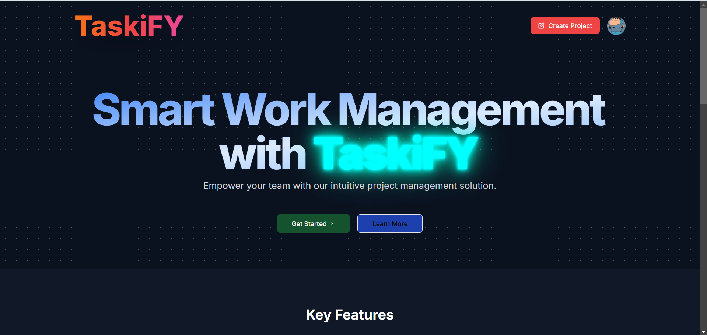
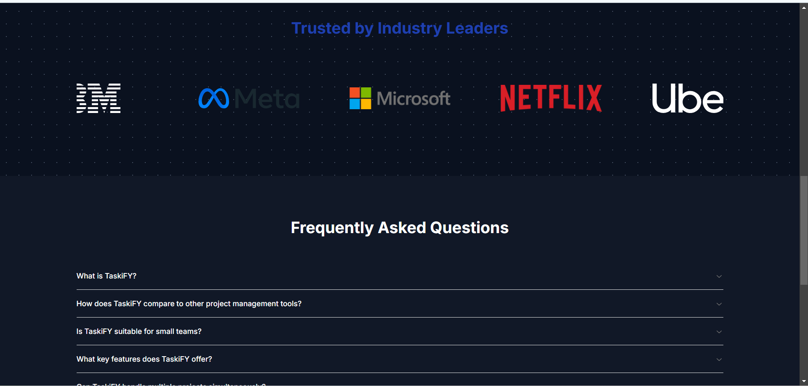
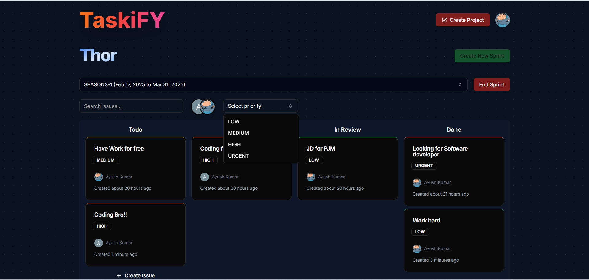
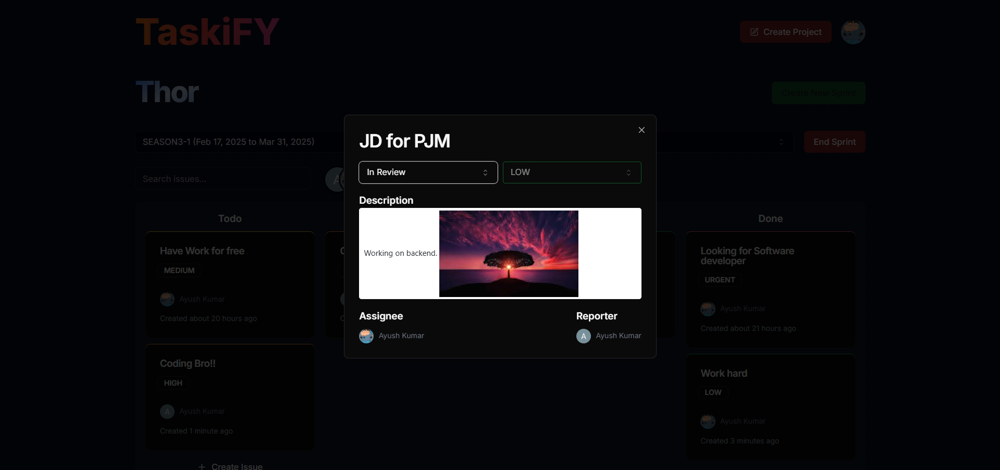
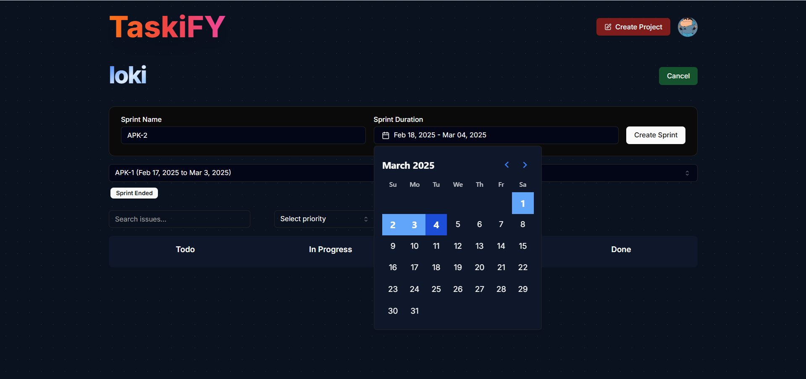
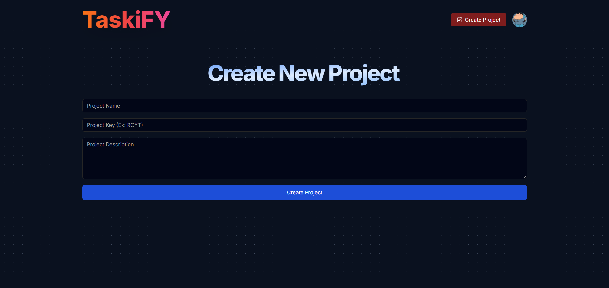

# TaskiFY🚀

TaskiFY is a modern and intuitive project management web application designed to streamline workflows and enhance team collaboration.

## 🌟 Preview of my Application

<p align="center">
  
  
  
  
  
  
</p>

## 🚀 Features

- 🏆 **Task Management** - Create, update, and track tasks effortlessly.
- 📅 **Kanban Board** - Visualize your workflow with drag-and-drop functionality.
- 🔔 **Notifications** - Stay updated with real-time notifications.
- 🔥 **Priority System** - Categorize tasks by priority levels (Low, Medium, High, Urgent).
- 👥 **User Authentication** - Secure login using Clerk authentication.
- 🎨 **Beautiful UI** - Built with Next.js, Tailwind CSS, and Shadcn UI for the best user experience.

## 🛠️ Tech Stack

- **Frontend:** Next.js, React, Tailwind CSS, Shadcn UI
- **Backend:** Next.js API Routes
- **Database:** NeonDB
- **Authentication:** Clerk

## ⚡ Installation & Setup

Follow these steps to run TaskiFY locally:

### 1️⃣ Clone the Repository

```bash
git clone https://github.com/ayushkumar1991/TaskiFY.git
cd TaskiFY

```

### 2. Install Dependencies:-

```bash
npm install --legacy-peer-deps
```

### 3. Set Up Environment Variables:-

Create a `.env.local` file in the root directory and add necessary API keys and credentials:

```
NEXT_PUBLIC_CLERK_PUBLISHABLE_KEY=your-clerk-key
CLERK_SECRET_KEY=your-secret-key

DATABASE_URL=your-neondb-url

NEXT_PUBLIC_CLERK_SIGN_IN_URL=/sign-in
NEXT_PUBLIC_CLERK_SIGN_UP_URL=/sign-up
NEXT_PUBLIC_CLERK_AFTER_SIGN_IN_URL=/onboarding
NEXT_PUBLIC_CLERK_AFTER_SIGN_UP_URL=/onboarding
```

### 4. Run the Application:-

```bash
npm run dev
```

The app will be available at [http://localhost:3000](http://localhost:3000).

## Contributing:-

Contributions are welcome! To contribute:

1. Fork the repository.
2. Create a new branch.
3. Make your changes and commit them.
4. Push to your fork and submit a pull request.

## License

This project is licensed under the [MIT License](https://opensource.org/licenses/MIT).

## Contact:-

For queries or feedback, reach out at **ayushkumr1991@gmail.com**.
